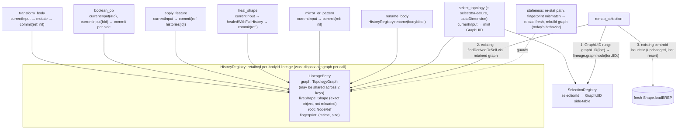

# BRepGraph-native persistent identity for selections (#91/#93 full completion)

## Context

`e924848` (already merged) fixed the *correlation* half of #90/#91/#93: `HistoryRegistry` absorbs a
mutation's real `BRepTools_History` via OCCTSwift 1.12's
`TopologyGraph.add(_:absorbing:inputRoots:operationName:)` instead of nearest-centroid guessing, and
`select_topology`/`remap_selection` mint selectionId indices via `TopologyGraph.findNode(for:)`
instead of trusting enumeration order (proven divergent for edges/vertices —
`TopologyIdentityTests.swift`).

What's still missing is #93's other acceptance criterion: **a body keeps one `TopologyGraph` across
successive mutations.** `HistoryRegistry.swift:31` holds `graphs: [String: TopologyGraph]`, replaced
wholesale on every mutating call — chain two history-bearing ops (e.g. `apply_feature` hole →
`apply_feature` fillet) and hop 2's fresh graph has no memory of hop 1, so a selection made before
hop 1 stops resolving after hop 2. `IntegrationTests.swift:589-800` proves the one-hop case; no test
proves two hops, because it currently doesn't work.

**This plan is BRepGraph-native — to be explicit about the naming.** OCCT's persistent-identity
engine is the C++ `BRepGraph` type; OCCTSwift's Swift-side surface for it is the class named
`TopologyGraph`, which is defined in `Sources/OCCTSwift/BRepGraph.swift` and wraps `BRepGraph`
directly (there is no separate Swift type called `BRepGraph` to use instead). Every `TopologyGraph`
call in this plan is therefore a BRepGraph call: `GraphUID` wraps `BRepGraph::UIDsView`, `add(_:
absorbing:...)` drives `BRepGraph_LayerHistory::Absorb`, and `findDerivedOrSelf`/`findNode` walk
BRepGraph's own node/history tables. What "focus on BRepGraph, not ad-hoc tracking" rules out — and
what this plan removes — is OCCTMCP-side bookkeeping layered *on top of* the graph: raw
`NodeRef(kind, index)` tuples persisted across calls, enumeration-order indices, hand-rolled
centroid/linear-scan correlation. Those all get replaced by BRepGraph's own primitives.

Owner direction, restated in those terms: persist selections as **`GraphUID`**
(`graph.uid(ofNodeKind:index:)` / `graph.node(forUID:)`), BRepGraph's durable-identity primitive,
not raw `NodeRef(kind, index)` bookkeeping. **Verified against OCCTSwift source at tag v1.12.10**
(raw-file fetch of `Sources/OCCTSwift/BRepGraph.swift`): `GraphUID` is real, public
(`Sendable, Hashable, Codable`, carrying `(kind, counter, graphID)`), and fully covered by the
currently pinned floor. Since v1.12.0 (#295) it **fails closed** — `node(forUID:)` rejects UIDs from
any other graph instance (via `instanceID` provenance) instead of silently resolving to a
wrong-but-plausible node. No upstream API request is needed for the UID layer. `TopologyRef` was
considered and ruled out (`.literal` doesn't forward-walk history; the other cases need a known
construction op name arbitrary picks don't have).

Findings that shape the design:

1. **`add()`'s history absorption correlates by `TShape` object identity.** `Shape.loadBREP` mints a
   new `TShape` tree every call, even for byte-identical content. Keeping the graph alive is not
   sufficient — the next mutation must operate on the *exact* in-memory `Shape` the retained graph
   knows, or `add()`'s absorb silently writes zero records. The lineage must cache the live `Shape`.
   This failure mode is inferred (docs say only "build the graph from the operation's input"), so
   `commit()` runtime-checks it rather than assuming it (step 2).
2. **`transform_body` / `mirror_or_pattern` can't join a retained chain today.** No
   `*WithFullHistory` variants exist for translate/rotate/scale/mirror/patterns, and
   `BRepBuilderAPI_Transform` forces a geometric copy. These stay a **generation reset** (identical
   to today, not a regression) until upstream adds the API — filed as an issue (step 11).
3. **OCCTSwift v1.13.0 shipped #327** (`healedWithFullHistory` / `sewWithFullHistory` /
   `quiltWithFullHistory` / `solidWithFullHistory`) — the stale comment at
   `HistoryRegistry.swift:110-114` claims otherwise. Per owner decision: **bump the floor to 1.13.1
   and wire `heal_shape` through real history in this change**, replacing the topology-count
   heuristic.
4. **Three #91-bypass call sites** mint `TopologyAnchor`s from raw indices:
   `GapFillerTools.selectByFeature` (`:204-241`, AAG `floorFaceIndex`/`faceIndex`),
   `AutoDimensionTool.autoDimension` (`:70`, `:128-147`, hand-rolled `indexOf` scan),
   `CorrespondenceTools.findCorrespondences` (`:220-226`, `:283-317`, `:391-402`, enumeration
   indexing). Verified exhaustive for the bug class: `RayPickTool` mints world-point `pick:` ids only;
   RemapTools/AnnotationsTools/DrawingTools/HealingTools are clean. (`query_topology` /
   `check_thickness` emit informational `face[i]`/`edge[i]` labels in enumeration order — a
   cross-referencing vocabulary hazard to document, not a minting bug; out of scope beyond docs.)

## Architecture



```
Timeline for the regression this fixes (drill hole, then fillet, same body):
  select_topology(part) ──mint sel:part#face[2] + GraphUID──┐
  apply_feature(hole)   ── currentInput(part) ──► liveShape₀, graph, root
                        ── commit(ref) ──► graph.add(output₁, absorbing: ref, inputRoots:[root])
                                           LineageEntry{ liveShape: output₁, root: root₁ }
  apply_feature(fillet) ── currentInput(part) ──► SAME graph object, liveShape = output₁ (not reloaded)
                        ── commit(ref) ──► graph.add(output₂, ...) — graph carries BOTH hops' history
  remap_selection       ── UID → node(forUID:) → findDerivedOrSelf across both hops ──► correct
```

**`commit()` decision tree** (the record-count guard converts finding 1 from an assumption into an
enforced invariant):

```
ref != nil ─ count records before; graph.add(output, absorbing: ref, inputRoots:[entry.root], op)
             add() ok AND record count grew ── yes → continuation: update liveShape/root/fingerprint
                                             └─ no  → GENERATION RESET (fresh graph from output)
ref == nil ─ GENERATION RESET (transform_body, mirror_or_pattern, no-history fallback paths)
```

**Two-input boolean**: keep the two-graph-instance design (`add()` requires input+result in one graph
instance, so a two-input op needs one graph per input side). Refinement: `outId`'s `LineageEntry`
gets its own `liveShape`/`root`/`fingerprint`, sharing only the `graph` *object reference* with
`aBodyId`'s entry — do not overwrite `aBodyId`'s entry (today's `graphs[aBodyId] = aGraph;
graphs[outId] = aGraph` was harmless only because every call rebuilt from scratch; under retention a
later `transform_body(aBodyId)` must not disturb `outId`'s lineage, and vice versa).

**GraphUID API signatures** (from source — get these right or it won't compile):
`uid(ofNodeKind: Int, index: Int) -> GraphUID?` takes a raw `Int` kind (pass
`node.kind.rawValue`) and returns an Optional; `node(forUID:) -> (kind: Int, index: Int)?` returns a
raw tuple, not a `NodeRef` — convert via `NodeKind(rawValue:)` before feeding `findDerivedOrSelf`.
Mint per-anchor: **no bulk UID API exists upstream**, don't design for batching.

## Implementation steps

1. **File the OCCTSwift issue first** (`gh issue create` against `SecondMouseAU/OCCTSwift` —
   issues-only process for that repo), so upstream work can begin while this change is implemented:
   request `*WithFullHistory` parity for
   `translated`/`rotated`/`scaled`/`mirrored`/`linearPattern`/`circularPattern` — **transforms and
   patterns only** (do NOT ask for heal/sew — v1.13.0 shipped those, and do NOT ask for GraphUID —
   it exists since v1.7.1). Cite the boolean/fillet/chamfer/shell/defeature precedent; note these
   are topology-preserving 1:1 (deterministic N:1 for patterns); point at the graph-level
   UID-preserving `translated(dx:dy:dz:copyGeometry:)`/`copy()` (UID cookbook identity table) as the
   natural design shape. Real GitHub-visible action — confirm the exact issue text before filing.

2. **`Package.swift`** — bump `occtDep("OCCTSwift", from: "1.12.10")` → `"1.13.1"`; extend the pin
   comment (v1.13.0 = #327 `*WithFullHistory` for heal/sew/quilt/solid). `swift build` to validate
   the cohort resolves before anything else.

3. **`Sources/OCCTMCPCore/HistoryRegistry.swift`** — replace `graphs` with
   `entries: [String: LineageEntry]`:
   - `struct LineageEntry { var graph: TopologyGraph; var liveShape: Shape; var root: TopologyGraph.NodeRef; var fingerprint: FileFingerprint }`;
     `struct FileFingerprint: Equatable { let mtime: TimeInterval; let size: Int64 }` (via
     `FileManager.attributesOfItem(atPath:)`).
   - `currentInput(bodyId:path:) throws -> (shape, graph, root, isFreshLoad)` — re-stat `path`;
     fingerprint match → return cached `(liveShape, graph, root, false)` with no disk read; any
     mismatch (no entry, or out-of-band rewrite e.g. `execute_script`) → `Shape.loadBREP`, fresh
     `TopologyGraph(shape:)`, root via `findNode(for:)`, cache, return `(…, true)`.
   - `commit(bodyId:path:output:ref:operationName:)` — per the decision tree above, including the
     record-count guard (compare the graph's history record count before/after `add()`; `add()`
     returning nil or a zero-record absorb both degrade to a generation reset rather than a
     history-less "continuation").
   - `rename(bodyId:to:)` — re-key the entry.
   - Rebuild `recordBooleanHistory`'s two-graph shape on top of `currentInput`/`commit` with the
     independent-`outId`-entry refinement above.
   - Delete the stale #327 comment (lines 110–114) and `recordIdentityHistoryIfTopologyPreserved` /
     `recordIdentityHistory` / `recordSingleInputHistory` once all callers are migrated.

4. **`Sources/OCCTMCPCore/Tools/ConstructionTools.swift`**
   - `transformBody` (load at `:66`): `currentInput` instead of `Shape.loadBREP`; replace the
     `recordIdentityHistory` call (`:124-128`) with `commit(ref: nil)` — generation reset, unchanged
     semantics.
   - `booleanOp` (loads at `:194-195`): `currentInput` for both sides; keep the
     `*WithFullHistory`/plain fallback branching (`:205-249`); commit per input side with `ref` when
     history exists (`ref: nil` on the fallback path), absorbing **once per graph object**.
   - `mirrorOrPattern` (load at `:364`): `currentInput` for the read; `commit(ref: nil)` for `outId`
     only — the **source** body's entry stays untouched (its file didn't change).

5. **`Sources/OCCTMCPCore/Tools/FeatureTools.swift`** — `applyFeature` (load at `:54`):
   `currentInput` + `commit(ref: result.histories[id])`. **Double-absorb hazard**: today's
   dual-recording (`:101-121`) absorbs the same ref into two *disposable* graphs — harmless; under
   retention, committing twice would write duplicate records into one shared graph. Absorb **once per
   graph object**: when `outputBodyId` names a new body, the new body's entry shares the graph
   reference with its own `liveShape = output` and the output file's fingerprint, while the source
   bodyId's entry keeps `liveShape = input` and the source file's fingerprint (overwriting it would
   corrupt the source lineage). If `result.histories` ever carries multiple entries, absorb in order
   against the entry's *current* root (chained commits move `root`).

6. **`Sources/OCCTMCPCore/Tools/HealingTools.swift`** — `heal_shape`: `currentInput`, then
   `inputShape.healedWithFullHistory()` (v1.13.0) → `commit(ref: history)`; fall back to plain
   `healed()` + `commit(ref: nil)` if the history variant returns nil. Drop the topology-count
   heuristic and update the "heal changed topology" warning wording (the history path now handles
   topology changes correctly instead of bailing to the centroid heuristic).

7. **`Sources/OCCTMCPCore/SelectionRegistry.swift`** — `import OCCTSwift`; private
   `graphUIDs: [String: TopologyGraph.GraphUID]` side-table (NOT a field on `AnchorSnapshot` — that
   struct is `Encodable` straight into LLM-facing responses; an opaque UID triple there is noise).
   Add `recordGraphUID(selectionId:uid:)` / `graphUID(for:)`; clear the side-table in `clear()` so it
   doesn't grow unboundedly.

8. **`Sources/OCCTMCPCore/Tools/SelectionTools.swift`** — `selectTopology` currently does
   `IntrospectionTools.loadShape` + disposable `TopologyGraph(shape:)` (`:68`). Swap to
   `HistoryRegistry.shared.currentInput(bodyId:path:)` so index resolution uses the retained graph;
   after each `registry.record(anchor:snapshot:)`, mint
   `graph.uid(ofNodeKind: node.kind.rawValue, index: node.index)` and `recordGraphUID`.
   `graphIndex(for:kind:in:fallback:)` stays — still needed for the index in the selectionId string.

9. **`Sources/OCCTMCPCore/Tools/RemapTools.swift`** — ahead of the existing
   `recordedGraph`/`remapViaHistory` lookup (`:90`, `:107-124`): `registry.graphUID(for: id)` →
   lineage `graph.node(forUID:)` → convert `(kind, index)` back to a `NodeRef` → same
   `findDerivedOrSelf` call. Fall through unchanged to the index-based path, then `pickClosest` — no
   fallback removed, one preferred rung added. After any successful remap (any rung), re-mint and
   store a fresh UID for the new anchor **from the retained lineage graph only** — never from the
   disposable `currentGraph` at `:95` (a UID minted from an unretained graph is permanently
   unresolvable), so a multi-hop remap chain stays UID-exact instead of degrading after one miss.

10. **Latent #91-bypass fixes** — same fix shape everywhere (route through
    `HistoryRegistry.currentInput`'s graph + `findNode(for:)`, mirroring `SelectionTools.graphIndex`;
    mint a UID for parity):
    - `GapFillerTools.selectByFeature` — resolve `pocket.floorFaceIndex`/`hole.faceIndex` via
      `Shape.fromFace(...)` → graph before building the `TopologyAnchor`.
    - `AutoDimensionTool.autoDimension` — replace `indexOf(rimEdge, in: allEdges)` with
      `graph.findNode(for: Shape.fromEdge(rimEdge))`.
    - `CorrespondenceTools.findCorrespondences` — `pickNearest`'s `anchorMaker` mints from raw array
      indices (`:283-317`, precompute at `:220-226`); resolve each winning index through the target
      body's graph before minting. `loadSourceCentroid` (`:391-402`) needs the same treatment.

11. **`Sources/OCCTMCPCore/Tools/SceneTools.swift`** — `renameBody` (`:107-152`): add
    `await HistoryRegistry.shared.rename(bodyId:to:)` so a retained lineage survives a rename.
    (selectionIds embed bodyId, so old selection strings still go stale on rename — today's behavior,
    document it.)

12. **`CLAUDE.md`** — rewrite "History wiring" + the OCCTSwift dependency note: retained
    `LineageEntry` model, GraphUID layer, 1.13.1 floor + heal_shape real history, per-tool table
    update, transform/mirror generation-reset ceiling (pointer to the filed issue). Also document:
    GraphUIDs are `Codable` but **instance-scoped** — they do not survive `GraphSnapshot` restore or
    process restart (rebuild mints a new `instanceID`; re-mint from `(kind, index)`), and a retained
    graph's `snapshot()` serializes the *pre-mutation* `sourceBREP` (captured at construction, not
    updated by `add()`); plus the `query_topology`/`check_thickness` enumeration-order label hazard.

### Critical files
- `Package.swift` (OCCTSwift floor → 1.13.1)
- `Sources/OCCTMCPCore/HistoryRegistry.swift`
- `Sources/OCCTMCPCore/SelectionRegistry.swift`
- `Sources/OCCTMCPCore/Tools/SelectionTools.swift`
- `Sources/OCCTMCPCore/Tools/RemapTools.swift`
- `Sources/OCCTMCPCore/Tools/ConstructionTools.swift`
- `Sources/OCCTMCPCore/Tools/FeatureTools.swift`
- `Sources/OCCTMCPCore/Tools/HealingTools.swift`
- `Sources/OCCTMCPCore/Tools/GapFillerTools.swift`
- `Sources/OCCTMCPCore/Tools/AutoDimensionTool.swift`
- `Sources/OCCTMCPCore/Tools/CorrespondenceTools.swift`
- `Sources/OCCTMCPCore/Tools/SceneTools.swift` (rename_body re-keying)
- `SwiftTests/OCCTMCPCoreTests/IntegrationTests.swift`
- `CLAUDE.md`

## Verification

- **Two-hop chain test** in `IntegrationTests.swift`, modeled on `historyRemapAcrossApplyFeature`
  (`:589`): `select_topology` → `apply_feature`(hole, in-place) → `apply_feature`(fillet, in-place)
  → `remap_selection` resolves (`preserved`/`split`, `confidenceMm == 0` — history path, not
  centroid). This is the test that catches the `TShape`-identity gap; it must fail on current code
  and pass after the rewire.
- **Staleness test**: `boolean_op` → out-of-band `.brep` rewrite (mimicking `execute_script`) →
  mutate again → degrades to a fresh rebuild (today's behavior), not silent corruption.
- **heal_shape history test**: selection survives `heal_shape` via the history path
  (`confidenceMm == 0`), replacing reliance on the topology-count heuristic.
- **In-process lineage assertions** (unit-level, alongside `TopologyIdentityTests`): the lineage
  `graph.instanceID` is unchanged across a two-hop chain, and a pre-hop-1 `GraphUID` still satisfies
  `graph.contains(uid:)` after hop 2 — directly proves "one graph across mutations".
- Full `swift test` (64 cases at `e924848`, plus new) stays green against the 1.13.1 cohort — the
  shipped single-hop tests are the regression backstop for the rewire.
- Manual smoke: `swift build -c release`, drive `select_topology` → `apply_feature` ×2 →
  `remap_selection` over the real MCP stdio interface once.
