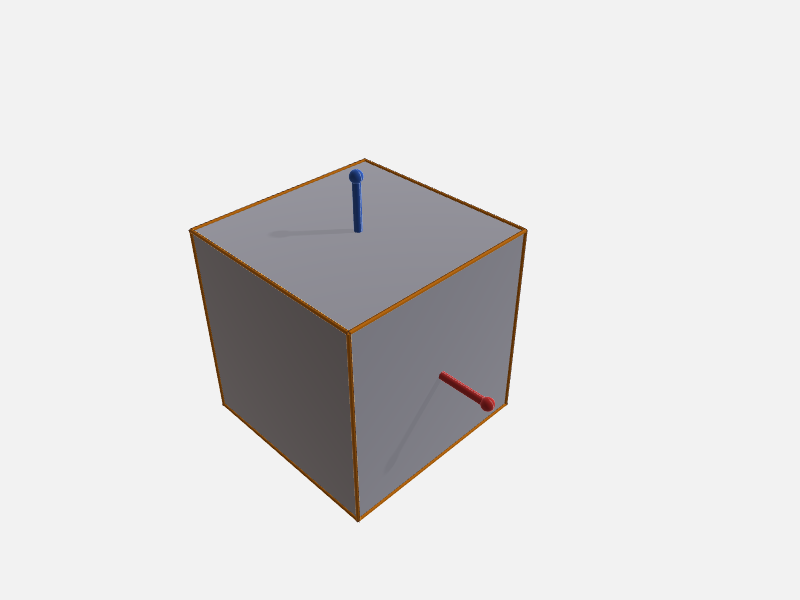

# Annotations & preview

This recipe annotates a machined bracket with dimensions and scene overlays, then renders a PNG
that shows every label and primitive in one shot. It also shows how to ray-cast a pixel back to a
world-space surface point and use it as a dimension anchor.

**Server note:** all annotation tools (`add_dimension`, `add_scene_primitive`, `show_bounding_box`,
`auto_dimension`, `list_annotations`, `remove_scene_annotation`) and `pick_surface_point` are
**Swift only** — they require `occtmcp-server`. `render_preview` runs on both servers.

Annotations are written to `<output_dir>/annotations.json` and overlaid automatically whenever
`render_preview` is called (controlled by `options.renderAnnotations`, default `true`).

---

## 1. Add a linear dimension between two faces {#add-dimension}

Use [`select_topology`](../../reference/selection.md#select_topology) to mint stable `selectionId`s
for the bottom and top planar faces of the bracket, then pass them as `anchors.from` / `anchors.to`
to [`add_dimension`](../../reference/annotations.md#add_dimension).

```json
// tool call arguments — select_topology (bottom face)
{
  "bodyId": "bracket",
  "entity": "face",
  "filter": { "surfaceType": "plane" },
  "limit": 2
}
```

```json
// example result
[
  { "id": "face[0]", "surfaceType": "plane", "centroid": [0.0, 0.0,  0.0] },
  { "id": "face[1]", "surfaceType": "plane", "centroid": [0.0, 0.0, 40.0] }
]
```

`select_topology` returns topology IDs (`face[N]`); prefix the body to form a full `selectionId`:

```json
// tool call arguments — add_dimension
{
  "kind": "linear",
  "id": "dim-height",
  "label": "H",
  "anchors": {
    "from": "sel:bracket#face[0]",
    "to":   "sel:bracket#face[1]"
  }
}
```

```json
// example result
{
  "id": "dim-height",
  "kind": "linear",
  "label": "H",
  "computedValue": 40.0
}
```

---

## 2. Drop a trihedron at the origin {#add-scene-primitive}

Place a coordinate trihedron using
[`add_scene_primitive`](../../reference/annotations.md#add_scene_primitive) to visually anchor the
world origin in the render.

```json
// tool call arguments
{
  "kind": "trihedron",
  "id": "origin-axes",
  "params": {
    "origin": [0, 0, 0],
    "axisLength": 20
  }
}
```

```json
// example result
{ "id": "origin-axes", "kind": "trihedron" }
```

---

## 3. Overlay the bounding box {#show-bounding-box}

[`show_bounding_box`](../../reference/annotations.md#show_bounding_box) registers a `boundingBox`
primitive **and** returns the extents inline — no separate `compute_metrics` call needed.

```json
// tool call arguments
{ "bodyId": "bracket", "primitiveId": "bbox-bracket" }
```

```json
// example result
{
  "primitiveId": "bbox-bracket",
  "min":    [ -25.0,  -15.0,  0.0],
  "max":    [  25.0,   15.0, 40.0],
  "extent": [  50.0,   30.0, 40.0],
  "center": [   0.0,    0.0, 20.0]
}
```

---

## 4. Auto-dimension all holes {#auto-dimension}

[`auto_dimension`](../../reference/annotations.md#auto_dimension) runs AAG hole detection and adds
a radial (or diameter) annotation to each hole's circular rim edge in one call.

```json
// tool call arguments
{ "bodyId": "bracket", "showDiameter": true }
```

```json
// example result
{
  "dimensions": [
    { "dimensionId": "auto-dim-0", "selectionId": "sel:bracket#edge[4]" },
    { "dimensionId": "auto-dim-1", "selectionId": "sel:bracket#edge[9]" }
  ]
}
```

---

## 5. Render to PNG {#render-preview}

[`render_preview`](../../reference/mesh-visualization.md#render_preview) performs a headless Metal
render. All annotations in `annotations.json` are composited automatically.

```json
// tool call arguments
{
  "outputPath": "<output_dir>/preview.png",
  "options": {
    "camera": "iso",
    "displayMode": "shadedWithEdges",
    "background": "light",
    "width": 1200,
    "height": 900
  }
}
```

```json
// example result
{
  "outputPath": "<output_dir>/preview.png",
  "width": 1200,
  "height": 900
}
```



---

## 6. Pick a surface point and dimension to it {#pick-surface-point}

[`pick_surface_point`](../../reference/mesh-visualization.md#pick_surface_point) casts a ray
through a pixel in the image produced in step 5 and returns the nearest world-space surface point
as a `selectionId` — directly usable as a dimension anchor.

Pass **the same `options`** used in `render_preview` so the pixel maps to the same camera ray.

```json
// tool call arguments
{
  "screenX": 650,
  "screenY": 430,
  "options": { "camera": "iso", "width": 1200, "height": 900 }
}
```

```json
// example result
{
  "point": [12.4, 0.0, 8.7],
  "bodyId": "bracket",
  "selectionId": "sel:bracket#surfacePoint[0]"
}
```

Use the returned `selectionId` as an anchor in a follow-on `add_dimension` call — for example to
measure from a face centroid to an arbitrary point on a fillet surface:

```json
// tool call arguments
{
  "kind": "linear",
  "id": "dim-fillet-offset",
  "anchors": {
    "from": "sel:bracket#face[0]",
    "to":   "sel:bracket#surfacePoint[0]"
  }
}
```

```json
// example result
{
  "id": "dim-fillet-offset",
  "kind": "linear",
  "computedValue": 8.7
}
```

---

## 7. Inspect and clean up {#inspect-remove}

[`list_annotations`](../../reference/annotations.md#list_annotations) reads the full sidecar:

```json
// tool call arguments
{}
```

```json
// example result
{
  "dimensions": [
    { "id": "dim-height",       "kind": "linear", "label": "H",  "computedValue": 40.0 },
    { "id": "auto-dim-0",       "kind": "radial",                 "computedValue": 4.0  },
    { "id": "auto-dim-1",       "kind": "radial",                 "computedValue": 4.0  },
    { "id": "dim-fillet-offset","kind": "linear",                 "computedValue": 8.7  }
  ],
  "primitives": [
    { "id": "origin-axes", "kind": "trihedron"  },
    { "id": "bbox-bracket", "kind": "boundingBox" }
  ]
}
```

Remove an annotation you no longer need with
[`remove_scene_annotation`](../../reference/annotations.md#remove_scene_annotation):

```json
// tool call arguments
{ "id": "bbox-bracket" }
```

```json
// example result
{ "found": true }
```

---

## What next?

- Carry `selectionId`s through a body mutation without re-picking →
  [Selection & remap](selection-and-remap.md) (Swift only)
- Produce a formal ISO multi-view DXF drawing from the same body →
  [Meshing & drawings](meshing-and-drawings.md)
- Verify wall thickness around the bracket holes →
  [Measurement & verification](measurement.md)
