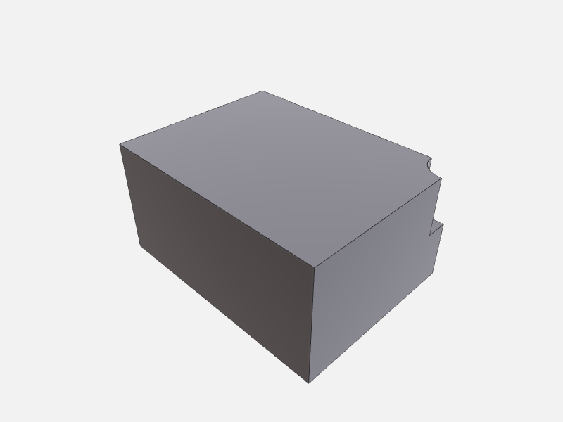

# Authoring with execute_script

`execute_script` is the escape hatch for geometry the typed tools don't cover: it compiles and runs
arbitrary Swift CAD code, writes the scene manifest, and triggers the OCCTSwiftViewport live reload.
Reach for it when you need to author a novel shape; for mutations (booleans, fillets, transforms,
patterns) prefer the typed tools — `boolean_op`, `apply_feature`, `transform_body`, etc. — which
record OCCT history and keep `selectionId`s remappable.

Full parameter reference: [execute_script](../../reference/core.md#execute_script) ·
[get_scene](../../reference/core.md#get_scene) · [get_script](../../reference/core.md#get_script).

---

## The script template

Every script passed to `execute_script` must follow this shape exactly:

```swift
import OCCTSwift
import ScriptHarness

let ctx = ScriptContext()
let C = ScriptContext.Colors.self

// ... build geometry with the OCCTSwift API (Shape.box, .cylinder, booleans, etc.) ...

try ctx.add(shape, id: "part", color: C.steel, name: "My Part")
try ctx.emit(description: "what this model is")
```

Key rules:

- Fallible OCCTSwift factories return optionals — always unwrap with `guard let`, never `!`.
- Boolean operators on `Shape`: `a - b` subtract, `a + b` union, `a & b` intersect.
- `ctx.add` registers each body with an `id` string that becomes its `bodyId` in every subsequent
  tool call. Choose stable, descriptive IDs.
- `ctx.emit` finalises the scene; omitting it leaves the manifest unchanged.

---

## Step 1 — Build a drilled block

The example below creates a 40 × 30 × 20 mm steel block and subtracts an 8 mm diameter through-hole.
This is the geometry that produced the figure on this page.

```json
// execute_script — arguments
{
  "description": "40×30×20 mm steel block with 8 mm through-hole",
  "code": "import OCCTSwift\nimport ScriptHarness\n\nlet ctx = ScriptContext()\nlet C = ScriptContext.Colors.self\n\n// Centre an 8 mm-dia hole on the top face, axis along Z, and drill it through.\nguard let block = Shape.box(width: 40, height: 30, depth: 20),\n      let holeRaw = Shape.cylinder(radius: 4, height: 20),\n      let hole = holeRaw.translated(by: SIMD3(20, 15, 0)),\n      let drilled = block - hole else {\n    throw ScriptError.message(\"build failed\")\n}\n\ntry ctx.add(drilled, id: \"drilled_block\", color: C.steel, name: \"Drilled Block\")\ntry ctx.emit(description: \"40×30×20 mm block with 8 mm through-hole\")\n"
}
```

```json
// example result
{
  "bodies": [
    {
      "id": "drilled_block",
      "name": "Drilled Block",
      "color": "steel",
      "brepFile": "drilled_block.brep"
    }
  ],
  "description": "40×30×20 mm block with 8 mm through-hole"
}
```

The first call takes ~60 s (full SPM build of OCCTSwift); subsequent calls are ~1–2 s incremental.
Compiler diagnostics appear under a `Script failed.` prefix on error — they reach the LLM directly
so you can iterate.

---

## Step 2 — Render a preview

Call `render_preview` immediately after building to produce the figure. The PNG is what the
maintainer commits to `docs/guides/cookbook/images/authoring.png`.

```json
// render_preview — arguments
{
  "outputPath": "<output_dir>/preview.png",
  "options": {
    "camera": "iso"
  }
}
```

```json
// example result
{
  "imagePath": "<output_dir>/preview.png",
  "width": 800,
  "height": 600
}
```



---

## Step 3 — Read the scene back

`get_scene` returns the live manifest — useful to confirm body IDs before passing them to
downstream tools.

```json
// get_scene — arguments
{}
```

```json
// example result
{
  "bodies": [
    {
      "id": "drilled_block",
      "name": "Drilled Block",
      "color": "steel",
      "brepFile": "drilled_block.brep"
    }
  ],
  "description": "40×30×20 mm block with 8 mm through-hole"
}
```

The `bodyId` (`"drilled_block"`) is what every other tool — `compute_metrics`, `apply_feature`,
`boolean_op`, `select_topology`, etc. — uses to address this body.

---

## Step 4 — Retrieve the source

`get_script` returns the Swift source of the most recent `execute_script` call in this session.
Handy for auditing or re-running after a session restart.

```json
// get_script — arguments
{}
```

```json
// example result
{
  "source": "import OCCTSwift\nimport ScriptHarness\n\nlet ctx = ScriptContext()\nlet C = ScriptContext.Colors.self\n\nguard let block = Shape.box(width: 40, height: 30, depth: 20) else { ... }\n..."
}
```

---

## Typed tools first

`execute_script` is the right choice when you need to author geometry from scratch using the full
OCCTSwift API. For everything that follows — drilling more holes, adding fillets, mirroring,
computing volume, querying faces — prefer the typed tools. They are faster (no recompile), record
OCCT topology history so `selectionId`s survive mutations, and have narrower, validated schemas that
catch mistakes before they reach the compiler.

| Need | Typed tool | Falls back to |
|------|-----------|---------------|
| Subtract / union / intersect two existing bodies | `boolean_op` | `execute_script` |
| Drill / fillet / chamfer / thread | `apply_feature` | `execute_script` |
| Translate / rotate / scale | `transform_body` | `execute_script` |
| Mirror / linear / circular pattern | `mirror_or_pattern` | `execute_script` |
| Novel geometry, procedural shapes | — | `execute_script` |
