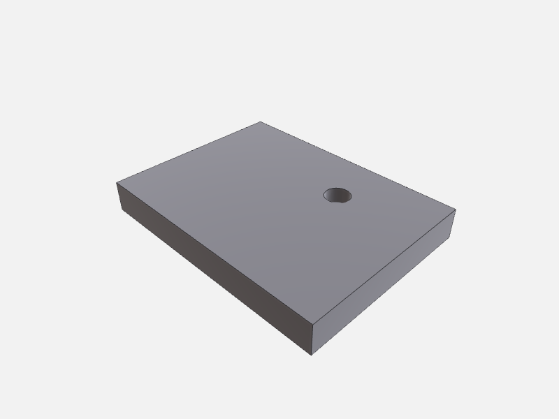

# Construction

Build up a part step by step using the four typed construction tools — no `execute_script` required. Each tool call consumes the `bodyId` output from the previous step, so the chain is readable end-to-end. Because `boolean_op` and `apply_feature` record topology history, any `selectionId` you picked before the mutation remaps cleanly afterwards; see [Selection & remap](../selection-and-remap.md).

All four tools are available on both the Swift `occtmcp-server` and the Node server.

**Scenario:** a mounting bracket — a rectangular block with a cylindrical pin subtracted, a fillet on the top edges, positioned at a working height, and a circular pattern of four mounting holes punched through the base.

---

## 1. Subtract a pin pocket — `boolean_op`

The scene already contains `block` (60 × 40 × 20 mm) and `pin` (Ø10 × 25 mm cylinder, centred on the block top face) created by an earlier `execute_script`. Subtract the pin to open a pocket.

```json
{
  "op": "subtract",
  "aBodyId": "block",
  "bBodyId": "pin",
  "outputBodyId": "bracket_raw",
  "removeInputs": true
}
```

```json
{
  "bodies": [
    { "id": "bracket_raw", "name": "bracket_raw" }
  ]
}
```

Reference: [`boolean_op`](../../reference/construction.md#boolean_op). The result body `bracket_raw` carries full per-input history for both `block` and `pin`, so any `selectionId` that lived on either survives a [`remap_selection`](../selection-and-remap.md) call.

---

## 2. Fillet the top edges — `apply_feature`

Round the four top edges of the pocket to R3 mm. The `kind` discriminator is `"fillet"`; supply the edge `selectionId`s minted by a prior [`select_topology`](../selection-and-remap.md) call (Swift only) or computed from the known topology.

```json
{
  "bodyId": "bracket_raw",
  "feature": {
    "kind": "fillet",
    "radius": 3.0,
    "edgeSelectionIds": [
      "sel:bracket_raw#edge[0]",
      "sel:bracket_raw#edge[1]",
      "sel:bracket_raw#edge[2]",
      "sel:bracket_raw#edge[3]"
    ]
  },
  "outputBodyId": "bracket_filleted"
}
```

```json
{
  "bodies": [
    { "id": "bracket_raw", "name": "bracket_raw" },
    { "id": "bracket_filleted", "name": "bracket_filleted" }
  ]
}
```

Reference: [`apply_feature`](../../reference/construction.md#apply_feature). The `drill` kind works the same way (needs `axisOrigin`, `axisDirection`, `diameter`, `depth` instead of `radius`).

---

## 3. Lift to working height — `transform_body`

Translate the filleted bracket 80 mm up the Z axis so it sits at mounting height. Keep the original for reference by using `outputBodyId`.

```json
{
  "bodyId": "bracket_filleted",
  "translate": [0, 0, 80],
  "outputBodyId": "bracket_placed"
}
```

```json
{
  "bodies": [
    { "id": "bracket_filleted", "name": "bracket_filleted" },
    { "id": "bracket_placed", "name": "bracket_placed" }
  ]
}
```

Reference: [`transform_body`](../../reference/construction.md#transform_body). `transform_body` is a rigid transform — topology is preserved 1-to-1, so any `selectionId` on `bracket_filleted` resolves to the same index on `bracket_placed` via the implicit identity path.

---

## 4. Circular pattern of mounting holes — `mirror_or_pattern`

Pattern a single mounting hole body (`hole`, Ø6 × 25 mm) four times around the Z axis centred at the bracket origin, then subtract the compound from `bracket_placed` to punch all four holes at once.

### 4a. Pattern the hole

```json
{
  "bodyId": "hole",
  "kind": "circular",
  "params": {
    "axisOrigin": [0, 0, 80],
    "axisDirection": [0, 0, 1],
    "totalCount": 4
  },
  "outputBodyId": "holes_pattern"
}
```

```json
{
  "bodies": [
    { "id": "hole", "name": "hole" },
    { "id": "bracket_placed", "name": "bracket_placed" },
    { "id": "holes_pattern", "name": "holes_pattern" }
  ]
}
```

### 4b. Subtract the pattern

```json
{
  "op": "subtract",
  "aBodyId": "bracket_placed",
  "bBodyId": "holes_pattern",
  "outputBodyId": "bracket_final",
  "removeInputs": true
}
```

```json
{
  "bodies": [
    { "id": "bracket_filleted", "name": "bracket_filleted" },
    { "id": "bracket_final", "name": "bracket_final" }
  ]
}
```

Reference: [`mirror_or_pattern`](../../reference/construction.md#mirror_or_pattern). For a linear pattern supply `direction`, `spacing`, and `count` instead. `mirror_or_pattern` outputs new bodies rather than mutating in place — use [`find_correspondences`](../selection-and-remap.md) (not `remap_selection`) to map a source `selectionId` onto one of the pattern copies.

---

## 5. Render the result

```json
{
  "outputPath": "<output_dir>/preview.png",
  "options": {
    "camera": "iso"
  }
}
```


