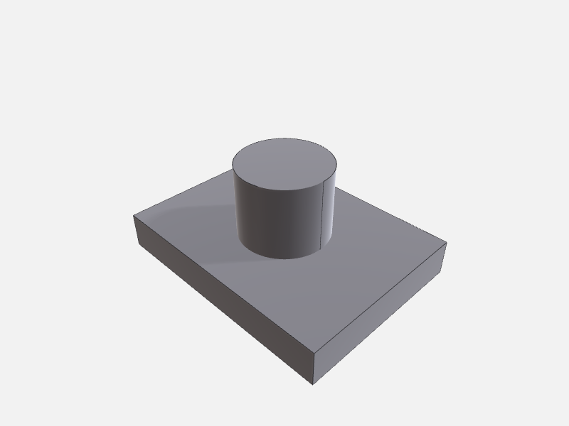
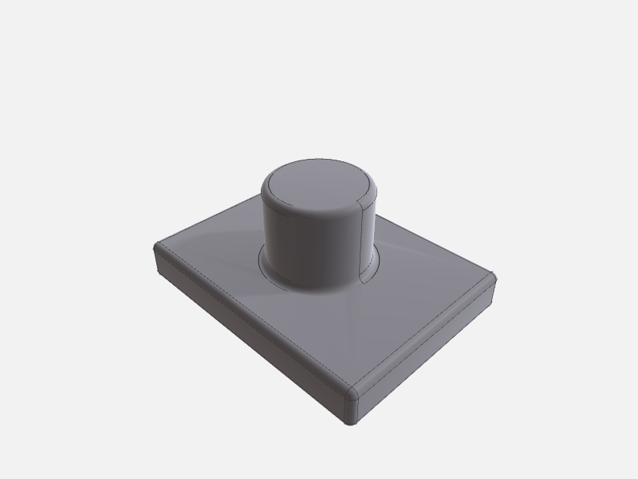
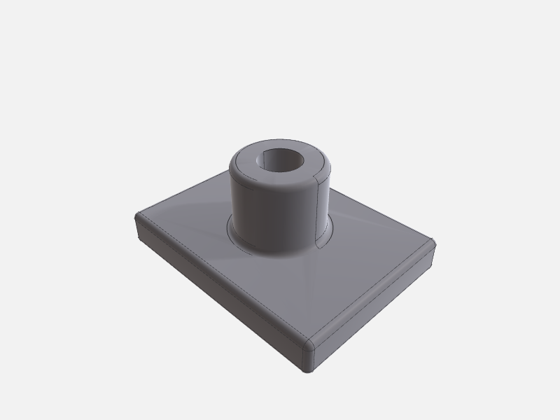
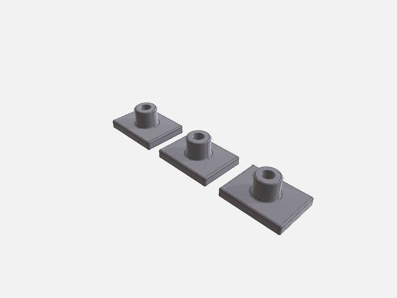

# Construction

Build a part up step by step with the typed construction tools — `boolean_op`, `apply_feature`,
`transform_body`, `mirror_or_pattern`. Each call **mutates the running body in place** (or feeds its
`outputBodyId` into the next step), so the model grows down the page and every render shows the
cumulative result. All four tools are on both the Swift `occtmcp-server` and the Node server.

Because `boolean_op` and `apply_feature` record topology history, a `selectionId` you picked before a
mutation remaps cleanly afterwards — see [Selection & remap](../selection-and-remap.md).

**Scenario — a mounting boss:** fuse a cylindrical post onto a base plate, round every edge, bore a
central hole, then replicate the finished part into a row.

Every step below is a real, runnable tool call; the figures are `render_preview` PNGs of the scene
*after* that step.

---

## 0. Seed two bodies — `execute_script`

There's no typed primitive-maker, so start the scene with a short script that adds the base `plate`
and the `post` that will become the boss (the post's base sits 4 mm inside the plate so the union is a
clean solid). Everything after this is typed tools.

```json
{
  "description": "base plate + post",
  "code": "import OCCTSwift\nimport ScriptHarness\n\nlet ctx = ScriptContext()\nlet C = ScriptContext.Colors.self\n\nguard let plate = Shape.box(origin: SIMD3(0, 0, 0), width: 80, height: 60, depth: 12),\n      let post = Shape.cylinder(at: SIMD3(40, 30, 8), direction: SIMD3(0, 0, 1), radius: 15, height: 28) else {\n    throw ScriptError.message(\"setup failed\")\n}\n\ntry ctx.add(plate, id: \"plate\", color: C.steel, name: \"Plate\")\ntry ctx.add(post,  id: \"post\",  color: C.steel, name: \"Post\")\ntry ctx.emit(description: \"base plate + post\")\n"
}
```



See [Authoring with execute_script](authoring.md) for the script template. Reference: [`execute_script`](../../reference/core.md#execute_script).

---

## 1. Fuse the post onto the plate — `boolean_op`

Union the two bodies into one solid `bracket`. `removeInputs: true` drops `plate` and `post` from the
scene, leaving just the fused result.

```json
{ "op": "union", "aBodyId": "plate", "bBodyId": "post", "outputBodyId": "bracket", "removeInputs": true }
```

```json
// result
{ "message": "Boolean union(plate, post) → \"bracket\"; inputs removed." }
```


Reference: [`boolean_op`](../../reference/construction.md#boolean_op) (`op`: `union` / `subtract` / `intersect` / `split`). `bracket` carries per-input history for both `plate` and `post`, so a `selectionId` that lived on either survives a [`remap_selection`](../selection-and-remap.md).

---

## 2. Round every edge — `apply_feature` (fillet)

The `fillet` feature blends **all** edges to the given radius — no edge list needed. Omitting
`outputBodyId` mutates `bracket` **in place**.

```json
{ "bodyId": "bracket", "feature": { "kind": "fillet", "radius": 2 } }
```

```json
// result
{ "bodyId": "bracket", "inPlace": true, "outputPath": "…/bracket.brep" }
```



Reference: [`apply_feature`](../../reference/construction.md#apply_feature). The `feature` object is a FeatureSpec keyed by `kind`; `fillet` takes just `radius`, `chamfer` takes `distance`.

---

## 3. Bore a central hole — `apply_feature` (hole)

The `hole` feature drills a cylinder along an axis. Here it goes straight down the part's centre
(`axis_point` above the top face, `axis_direction` pointing down), again in place.

```json
{
  "bodyId": "bracket",
  "feature": {
    "kind": "hole",
    "axis_point": [40, 30, 40],
    "axis_direction": [0, 0, -1],
    "diameter": 14,
    "depth": 44
  }
}
```



Reference: [`apply_feature`](../../reference/construction.md#apply_feature). Note the snake_case keys (`axis_point`, `axis_direction`) — this is the FeatureSpec JSON the reconstructor decodes. This is the finished single part.

---

## 4. Replicate into a row — `mirror_or_pattern`

A linear pattern copies the finished `bracket` along a direction. `mirror_or_pattern` produces **new**
bodies rather than mutating in place, so it takes an `outputBodyId`.

```json
{
  "bodyId": "bracket",
  "kind": "linear",
  "params": { "direction": [1, 0, 0], "spacing": 100, "count": 3 },
  "outputBodyId": "row"
}
```

```json
// result
{ "message": "Pattern linear on \"bracket\" → \"row\"." }
```



Reference: [`mirror_or_pattern`](../../reference/construction.md#mirror_or_pattern) — `circular` takes `axisOrigin` / `axisDirection` / `totalCount`; `mirror` takes a plane. Because the copies aren't OCCT history-derivatives of the source, map a source `selectionId` onto a copy with [`find_correspondences`](../selection-and-remap.md), not `remap_selection`.

---

## The finished part

The single bored bracket from step 3, as an interactive model (drag to orbit):

<script type="module" src="https://cdn.jsdelivr.net/npm/@google/model-viewer/dist/model-viewer.min.js"></script>

<model-viewer src="models/construction.glb" poster="images/construction-4-bore.png" alt="Boss bracket with central bore" camera-controls auto-rotate environment-image="neutral" exposure="1.1" shadow-intensity="1" style="width:100%;max-width:480px;height:360px;background:#eef1f5;border-radius:6px"></model-viewer>

<sub>🖱️ Drag to orbit · scroll to zoom · auto-rotating. The static render shows until the 3D model loads. (Model exported from this recipe's tool calls via `export_scene` → glTF.)</sub>

To render any step yourself, call [`render_preview`](../../reference/mesh-visualization.md#render_preview) with `{ "outputPath": "<output_dir>/preview.png", "options": { "camera": "iso" } }`.
