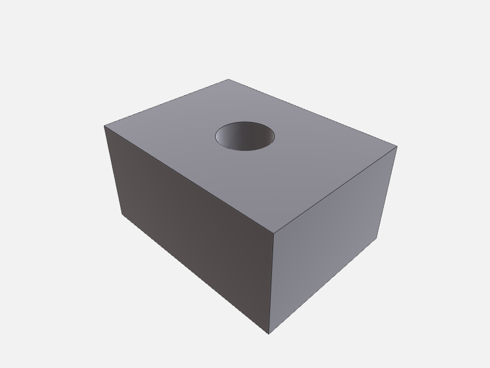

# Scene & appearance

These tools let you read and reshape the live scene manifest without re-running a script. Every write
triggers an automatic viewport reload via `ScriptWatcher`. All five tools are available on both the
Swift and Node servers.

For visual output — PNG previews, dimension overlays, bounding boxes — see
[Annotations & preview](annotations-and-preview.md).

---

## 1. Read the scene

Call [`get_scene`](../../reference/core.md#get_scene) at any point to inspect what bodies are currently
loaded, their display names, colors, and material properties.

```json
// tool: get_scene — arguments
{}
```

```json
// example result
{
  "bodies": [
    {
      "id": "housing",
      "name": "Housing",
      "color": [0.7, 0.7, 0.75, 1.0],
      "roughness": 0.4,
      "metallic": 0.6
    },
    {
      "id": "lid",
      "name": "Lid",
      "color": [0.2, 0.5, 0.9, 1.0],
      "roughness": 0.3,
      "metallic": 0.0
    }
  ],
  "description": "Two-part enclosure"
}
```

---

## 2. Recolor and set material properties

[`set_appearance`](../../reference/scene-mutation.md#set_appearance) updates color, opacity, roughness,
metallic, and display name in one call. Only `bodyId` is required; all other fields are optional and
leave the existing values unchanged if omitted.

**Change color and make translucent:**



```json
// tool: set_appearance — arguments
{
  "bodyId": "widget",
  "color": [0.85, 0.12, 0.12],
  "opacity": 0.65
}
```

```json
// example result
{
  "updated": "widget",
  "color": [0.85, 0.12, 0.12, 0.65]
}
```


**Set PBR metallic / roughness for a steel look:**

```json
// tool: set_appearance — arguments
{
  "bodyId": "lid",
  "color": [0.75, 0.75, 0.78],
  "roughness": 0.2,
  "metallic": 0.9,
  "name": "Lid (brushed steel)"
}
```

```json
// example result
{
  "updated": "lid",
  "color": [0.75, 0.75, 0.78, 1.0],
  "roughness": 0.2,
  "metallic": 0.9,
  "name": "Lid (brushed steel)"
}
```

`color` is RGBA or RGB with values 0–1. `opacity` is a convenience shorthand that sets the alpha
channel while leaving RGB unchanged — it is additive with the alpha in `color` (last write wins).

---

## 3. Rename a body

[`rename_body`](../../reference/scene-mutation.md#rename_body) changes a body's `id` in the manifest.
Fails if `newBodyId` is already taken.

```json
// tool: rename_body — arguments
{
  "bodyId": "part",
  "newBodyId": "housing"
}
```

```json
// example result
{ "renamed": { "from": "part", "to": "housing" } }
```

After renaming, any stored `selectionId`s that embed the old id (format `sel:<bodyId>#<kind>[<idx>]`)
become stale — re-select or use [`remap_selection`](../../reference/selection-and-remap.md#remap_selection)
(Swift only) to carry them across.

---

## 4. Remove a body

[`remove_body`](../../reference/scene-mutation.md#remove_body) deletes one body from the scene and
removes its BREP file from the output directory.

```json
// tool: remove_body — arguments
{ "bodyId": "lid" }
```

```json
// example result
{ "removed": "lid" }
```

To remove everything, use [`clear_scene`](../../reference/scene-mutation.md#clear_scene) instead.

---

## 5. Clear the scene

[`clear_scene`](../../reference/scene-mutation.md#clear_scene) removes every body. Pass
`keepHistory: true` to retain the `compare_versions` ring buffer across the reset — useful when you
want to diff the rebuilt scene against a state from before the wipe.

```json
// tool: clear_scene — arguments
{ "keepHistory": true }
```

```json
// example result
{ "cleared": 2 }
```

---

## 6. Diff against an earlier run

[`compare_versions`](../../reference/scene-mutation.md#compare_versions) diffs the current scene against
a snapshot taken before one of the last 10 `execute_script` runs. Pure manifest mutations
(`set_appearance`, `rename_body`, etc.) do not advance the snapshot counter — only `execute_script`
does.

```json
// tool: compare_versions — arguments
{ "since": 1 }
```

```json
// example result
{
  "since": 1,
  "added": ["rib"],
  "removed": [],
  "appearanceChanged": ["housing"],
  "fileChanged": ["housing"]
}
```

`fileChanged` means the underlying BREP changed (geometry was rebuilt); `appearanceChanged` means only
manifest metadata (color, name, etc.) differs. A body can appear in both lists.

Use `since: 2` to look further back — e.g. to compare the current state against a run before a
multi-step editing session. Requesting a depth beyond available history returns an error.

---

## The widget — interactive model

<script type="module" src="https://cdn.jsdelivr.net/npm/@google/model-viewer/dist/model-viewer.min.js"></script>

<model-viewer src="models/scene-and-appearance.glb" poster="images/scene-appearance-default.png" alt="Widget" camera-controls auto-rotate environment-image="neutral" exposure="1.1" shadow-intensity="1" style="width:100%;max-width:480px;height:360px;background:#eef1f5;border-radius:6px"></model-viewer>

<sub>🖱️ Drag to orbit · scroll to zoom · auto-rotating. (Model exported via `export_scene` → glTF.)</sub>
